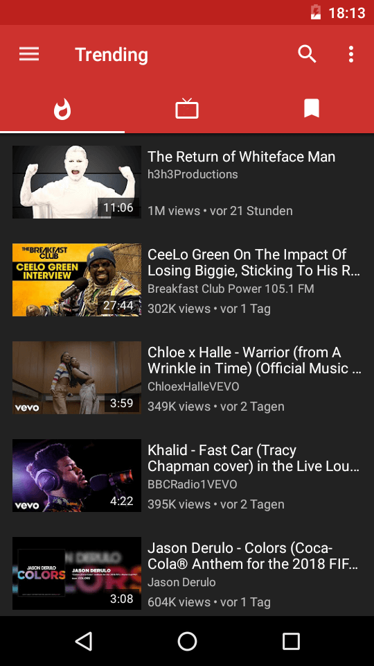

<h3 align="center">We are planning to <i>rewrite</i> large chunks of the codebase, to bring about <a href="https://github.com/TeamNightTube/NightTube/discussions/10118">a new, modern and stable NightTube</a>!</h3>
<h4 align="center">Please do <b>not</b> open pull requests for <i>new features</i> now, only bugfix PRs will be accepted.</h4>

<h2 align="center"><b>NightTube</b></h2>
<h4 align="center">A libre lightweight streaming front-end for Android.</h4>

<a href="#screenshots">Screenshots</a> • <a href="#supported-services">Supported Services</a> • <a href="#description">Description</a> • <a href="#features">Features</a> • <a href="#installation-and-updates">Installation and updates</a> • <a href="#contribution">Contribution</a> • <a href="#donate">Donate</a> • <a href="#license">License</a>

<a href="https://nighttube.net">Website</a> • <a href="https://nighttube.net/blog/">Blog</a> • <a href="https://nighttube.net/FAQ/">FAQ</a> • <a href="https://nighttube.net/press/">Press</a>

*Read this in other languages: [English](README.md), [Español](doc/README.es.md), [हिन्दी](doc/README.hi.md), [한국어](doc/README.ko.md), [Soomaali](doc/README.so.md), [Português Brasil](doc/README.pt_BR.md), [Polski](doc/README.pl.md), [日本語](doc/README.ja.md), [Română](doc/README.ro.md), [Türkçe](doc/README.tr.md), [正體中文](doc/README.zh_TW.md).*

<b>WARNING: THIS APP IS IN BETA, SO YOU MAY ENCOUNTER BUGS. IF YOU DO, OPEN AN ISSUE IN OUR GITHUB REPOSITORY BY FILLING OUT THE ISSUE TEMPLATE.</b>

<b>PUTTING NIGHTTUBE, OR ANY FORK OF IT, INTO THE GOOGLE PLAY STORE VIOLATES THEIR TERMS AND CONDITIONS.</b>

## Screenshots

*(screenshots kept same paths for now — update if you rename assets)*

...

### Supported Services

NightTube currently supports these services:

* YouTube ([website](https://www.youtube.com/)) and YouTube Music ([website](https://music.youtube.com/))
* PeerTube ([website](https://joinpeertube.org/)) and its instances
* Bandcamp ([website](https://bandcamp.com/))
* SoundCloud ([website](https://soundcloud.com/))
* media.ccc.de ([website](https://media.ccc.de/))

As you can see, NightTube supports multiple video and audio services. Though it started off with YouTube, other people have added more services over the years, making NightTube more versatile!

If you intend to add a new service, please get in touch first! Docs: [NightTube Extractor](https://github.com/TeamNightTube/NightTubeExtractor).

## Description

NightTube works by fetching the required data from the official API (e.g. PeerTube) of the service you're using. If restricted (e.g. YouTube), the app parses the website or uses internal APIs.  
No accounts required.  
No proprietary Google Play Services dependencies.

### Features

* Watch videos up to 4K
* Listen in background (audio only)
* Picture-in-Picture
* Live streams
* Subtitles/CC
* Search (videos, channels, playlists, albums)
* Enqueue & playlists
* Channel subscriptions (without login!)
* Notifications for new uploads
* History, groups, feeds
* Local playlist support
* Download videos, audios, subtitles
* Open in Kodi
* Age-restricted content support

## Installation and updates

You can install NightTube via:

1. Add the custom repo to F-Droid and install. (instructions: https://nighttube.net/FAQ/tutorials/install-add-fdroid-repo/)  
2. Download APK from [GitHub Releases](https://github.com/TeamNightTube/NightTube/releases).  
3. Update via F-Droid (slower).  
4. Build a debug APK yourself.  
5. Download PR-specific APKs from GitHub Actions.

⚠️ Always back up data before switching sources.  

## Contribution

Help is always welcome — translations, bugfixes, design, features.  
See [Contribution Notes](.github/CONTRIBUTING.md).

## Donate

If you like NightTube, you can support development:  

<table>
  <tr>
    <td></td>
    <td></td>
    <td></td>
  </tr>
  <tr>
    <td></td>
    <td></td>
    <td><samp>16A9J59ahMRqkLSZjhYj33n9j3fMztFxnh</samp></td>
  </tr>
  <tr>
    <td></td>
    <td></td>
    <td></td>
  </tr>
</table>

## Privacy Policy

The NightTube project aims to provide a private, anonymous experience for using web-based media services.  
NightTube does not collect any data without your consent.  

Read the full policy: [Privacy Policy](https://nighttube.net/legal/privacy/).

## License
  

NightTube is Free Software under the [GNU GPLv3](https://www.gnu.org/licenses/gpl.html).
